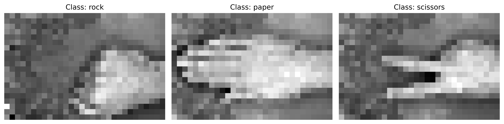
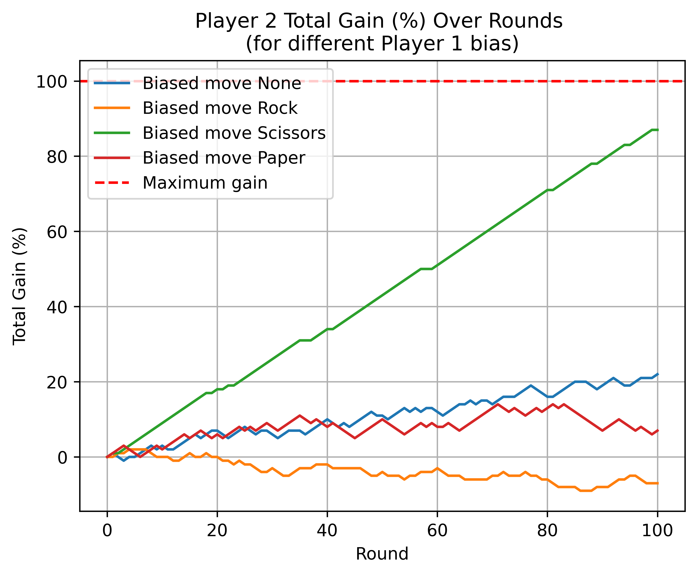
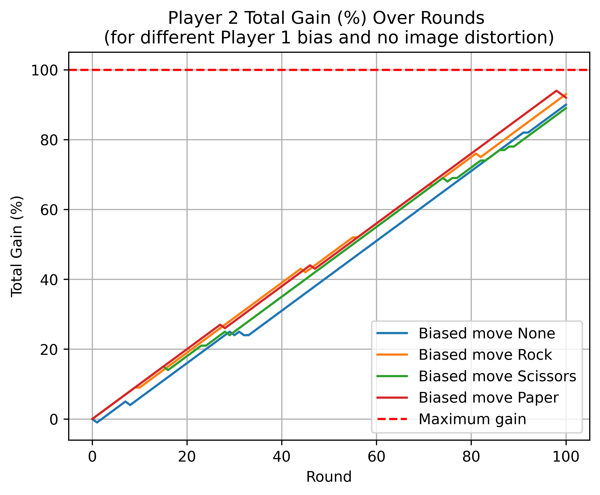
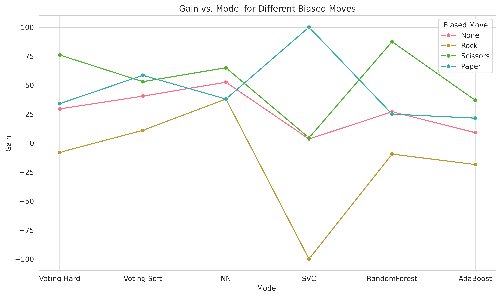
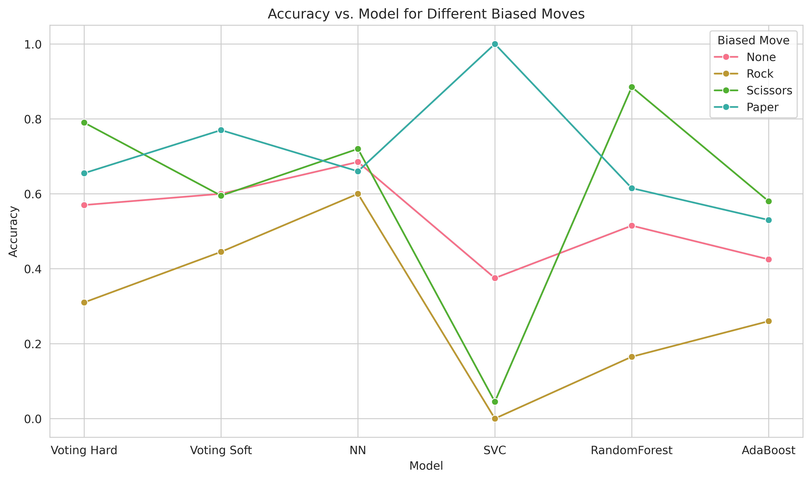

# Machine Learning Project for DWS Master's Program

## Overview
This Python code is part of a project submitted for the Machine Learning course in the Data and Web Science (DWS) Master's Program at Aristotle University of Thessaloniki. The project aims to demonstrate the application of various machine learning techniques and principles learned throughout the course.

## Project Description
The project involves developing 
an intelligent agent to play Rock-Scissors-Paper. The agent will interpret 
images corresponding to the three symbols (rock, scissors, paper) 
and select the winning symbol against an opponent. Training data for 
the agent can be sourced from a specified Kaggle dataset containing over 
700 images for each move ([Rock Paper Scissors dataset on 
Kaggle](https://www.kaggle.com/datasets/eng0mohamed0nabil/rock-paper-scissors-dataset)
).

The gameplay includes betting against a "Random Agent" over several rounds, 
with financial rewards or penalties based on the outcome of each round. 
The Random Agent employs certain strategies like image flipping and 
adding noise to make the game challenging. The objective is 
to maximize the agent's profit and analyze its performance, including testing 
the agent's accuracy on external images.
## Table of Contents

- [Data Loading and Preprocessing - `dataset` Class](#data-loading-and-preprocessing---dataset-class)
- [Random Agent Behavior - `RandomAgent` Class](#random-agent-behavior---randomagent-class)
- [Smart Agent Functionality - `SmartAgent` Class](#smart-agent-functionality---smartagent-class)
- [Game Environment Dynamics - `gameEnviroment` Class](#game-environment-dynamics---gameenviroment-class)
- [Main Experiment Setup](#main-experiment-setup)
- [Analysis of Classifier Performance in Varied Game Conditions](#analysis-of-classifier-performance-in-varied-game-conditions)
- [Conclusion](#conclusion)

## Data Loading and Preprocessing - `dataset` Class

The `dataset` class is central to handling the image data required for the machine 
learning aspects of the project. It is responsible for the crucial steps of loading, 
processing, and preparing the images.

### Key Functionalities
- **Image Loading in Grayscale**: Converts images to grayscale to reduce complexity.
- **Image Downsizing and Resizing**: Offers flexibility to resize images by a specific 
ratio or dimensions.
- **Normalization with MinMaxScaler**: Normalizes pixel values to a range of 0 to 1.

### Key Methods
- **`__init__`**: Initializes the dataset class.
- **`load_and_process_images`**: Processes the images, including resizing and normalization.
- **`print_dataset_size`**: Outputs the size of the dataset.
- **`display_random_images_per_class`**: Shows random images from each class.
- **`split_train_test_set`**: Splits the dataset into training and testing sets.

## Random Agent Behavior - `RandomAgent` Class

The `RandomAgent` class is designed for the Rock-Paper-Scissors game, selecting and 
distorting images to challenge the opponent's identification ability. RandomAgent is capable 
of playing random or specific moves, providing insights into the Smart Agent's performance 
across different categories.

### Key Functionalities
- **Image Selection**: Chooses images either randomly or biased towards a specific move (`biasedMove`).
- **Image Distortion Techniques**:
  - **Vertical Flip**: Applies vertical flips with a certain probability (`p_vertical_flip`).
  - **Horizontal Flip**: Applies horizontal flips with a certain probability (`p_horizontal_flip`).
  - **Gaussian Noise**: Adds Gaussian noise to images (`noise_sigma`).

## Smart Agent Functionality - `SmartAgent` Class

The `SmartAgent` class plays a pivotal role in the Rock-Paper-Scissors game, tasked 
with identifying the opponent's move and responding accordingly.

### Primary Functionality
- **Image Classification and Game Move Selection**: Central to the SmartAgent's role 
is classifying images to determine the opponent's move and selecting the counter move based 
on the game's rules.
- **Training the Classifier**: Capable of training a classifier on a given training set, 
which is then used for image classification during gameplay.

### Secondary Functionality
- **Testing Multiple Classifiers**: Includes functions for testing various classifiers, 
using grid search and k-fold cross-validation, to identify the most effective model.
- **Testing Ensemble Models**: The class can also evaluate ensemble models like Voting or 
Stacking classifiers, enhancing the agent's strategy and performance in image classification.

## Game Environment Dynamics - `gameEnviroment` Class

The `gameEnviroment` class orchestrates the Rock-Paper-Scissors game, setting up 
rewards and managing the interaction between two players.

### Initialization and Rewards
- **Rewards Setup**: Initializes the game with specific rewards for Player 2, 
- based on the outcome of each round.

### Gameplay Mechanics
- **Player Roles**: Facilitates gameplay between Player 1 (RandomAgent) and Player 2 
(SmartAgent), with Player 1 moving first.
- **Rounds and Computation**: Conducts a specified number of rounds, calculating 
Player 2's total gain in percentage and their move prediction accuracy.

### Customization Options
- **Verbose Output**: Option to enable detailed output for each round.
- **Gain History Visualization**: Feature to visualize Player 2's gain throughout the game.
- **Final Results Display**: Provides overall game results at the conclusion of the specified rounds.

## Main Experiment Setup

### Step 1: Kaggle Dataset Preparation
- **Dataset Downsizing**: Images from the Kaggle dataset are reduced to 20% of their 
original dimensions for efficient processing (`downsize_ratio = 0.1`).

- **Normalization Output**:

  `Before Normalization`

  `Minimum Value: 2, Maximum Value: 252`

  `After Normalization`

  `Minimum Value: 0.0, Maximum Value: 1.0000000000000002`

- **Dataset size**:

  `Images size: (2188, 20, 30)`

  `Labels size: (2188,)`

### Step 2: Visual Representation

### Step 3: Train-Test Split
- **Data Splitting**: The dataset is divided into training and testing 
sets with a `test_set_ratio` of 0.3.

  `Datasets for training and testing`

  `Train set size: (1531, 600)`

  `Test set size: (657, 600)`

### Step 4: Classifier Evaluation with 'testAgent'

A `testAgent` was implemented using the `SmartAgent` class framework 
to facilitate the evaluation of multiple classifiers.

#### Classifiers and Evaluation Method
- **Tested Classifiers**: Neural Network (NN), Support Vector Classifier (SVC), 
Random Forest, and AdaBoost.
- **Grid Search and Cross-Validation**: Applied grid search coupled with 
StratifiedKFold cross-validation using `n_splits=5` for each classifier.
- **Ensemble Classifiers**: Voting with the best 
models from the grid search

#### Why were these classifiers choosen?

- **Neural Network (NN)**: Neural Networks are particularly well-suited for image classification due 
to their ability to learn complex patterns in high-dimensional data. Their flexible architecture
allows them to be customized for various types of image data. NNs can effectively handle the 
intricate structures within images, making them a powerful tool for tasks requiring nuanced 
understanding of visual inputs.

- **Support Vector Machine (SVM)**: Support Vector Machines are effective for image classification as 
they excel in high-dimensional spaces, typical of image data. SVMs are known for their robustness, 
particularly in creating clear margins of separation between different classes. This capability 
makes them suitable for datasets where precision in classification is crucial, and they are also 
known for their resistance to overfitting in complex spaces.

- **Random Forest**: Random Forest is a strong candidate for image classification tasks due 
to its ensemble approach, combining multiple decision trees to reduce overfitting and improve 
generalization. This method works well with the non-linear nature of image data and is capable 
of handling high-dimensional spaces efficiently. Furthermore, Random Forests provide insights 
into feature importance, which can be particularly useful for understanding image data.

- **AdaBoost: AdaBoost** is suitable for image classification as it combines multiple weak 
learners to form a strong classifier, focusing on difficult-to-classify instances by 
adjusting weights iteratively. This adaptability can lead to improved accuracy and 
less susceptibility to overfitting. AdaBoost's approach to incrementally building a 
model makes it effective for complex tasks like image classification, where nuanced 
differences between categories must be captured.

#### Evaluation Results Table

| Classifier    | Parameter(s) | Accuracy                                                                                                                              | Precision (micro)                                                                                                  | Recall (micro)                                                                                  | F1-Score (micro)                                                             | Precision (macro)                                        | Recall (macro)                         | F1-Score (macro)    |
|---------------|----------|---------------------------------------------------------------------------------------------------------------------------------------|--------------------------------------------------------------------------------------------------------------------|-------------------------------------------------------------------------------------------------|------------------------------------------------------------------------------|----------------------------------------------------------|----------------------------------------|---------------------|
| NN            | {'hidden_layer_sizes': (200, 100),  'learning_rate_init': 0.0001,  'max_iter': 1000,  'solver': 'adam'}         | 0.9163930936109514                                                                                                                    | 0.9163930936109514	                                                                                                | 0.9163930936109514	                                                                             | 0.9163930936109514	                                                          | 0.9184882159211378	                                      | 0.9159886907458252	                    | 0.9161181551660332- |
| SVC           | {'C': 10, 'kernel': 'rbf'}         | 0.9111664644142131	                                                                                                                   | 0.9111664644142131	                                                                                                | 0.9111664644142131	                                                                             | 0.9111664644142131	                                                          | 0.9132314743793503	                                      | 0.9107163679953431                     | 	0.9111222632506912 |
| RandomForest  | {'min_samples_split': 2, 'n_estimators': 200}         | 0.9281514125737157	                                                                                                                   | 0.9281514125737157	                                                                                                | 0.9281514125737157	                                                                             | 0.9281514125737157	                                                          | 0.9294685152731608	                                      | 0.9277066266850774	                    | 0.92780957156043    |
| AdaBoost      | {'learning_rate': 1.0, 'n_estimators': 400}         | 0.8295224713120863 | 	0.8295224713120863| 	0.8295224713120863| 	0.8295224713120861	| 0.8337069379679004| 	0.8297821967070658| 	0.8296690754821411 |

| Classifier  | Accuracy | Precision (micro) | Recall (micro) | F1-Score (micro) | Precision (macro) | Recall (macro) | F1-Score (macro) |
|-------------|----------|-------------------|----------------|------------------|-------------------|----------------|------------------|
| Voting Hard | 0.926848|	0.926848|	0.926848|	0.926848|	0.927714|	0.926541|	0.926515|
| Voting Soft | 0.926193|	0.926193|	0.926193|	0.926193|	0.927495|	0.925812|	0.925939|

### Step 5: Create Player 1

A `player1Agent` was implemented using the `RandomAgent` class framework and the test set.

- `player1Agent = RandomAgent(X_test, y_test)`

### Step 6: Create Player 2

A `player2Agent` was implemented using the `SmartAgent` class framework and the train set.

- `clf = `

- `player2Agent = SmartAgent()`

- `player2Agent.train_classifier(clf,X_train,y_train)`

### Step 7: Game example for `rounds = 100` and `biasedMove = [None, 0, 1, 2]`

The `gameEnviroment` class was utilized to create an environment where the rewards 
for Player 2 were configured as follows: `win_reward` at 2, `tie_reward` at 1, 
`loss_reward` at 0, and `bet_amount` set to 1. The following plot demonstrates 
Player 2's performance across 100 rounds against Player 1, covering scenarios 
where Player 1's moves were either random or biased towards a specific choice.
 

| Biased move | Player's 2 gain (%) | Player's 2 accuracy |
|-------------|---------------------|---------------------|
| None        | 22                  | 0.52                |
| Rock        | -7                  | 0.21                |
| Scissors    | 87                  | 0.87                |
| Paper       | 7                   | 0.53                |

Interestingly, the classifier's accuracy in identifying the opponent's 
move was lower compared to the training phase. In the case where Player 1 
randomly chooses moves, Player 2's gain percentage was observed at 22%, 
a positive outcome but not optimal. A similar pattern emerged when Player 1 
consistently chose Paper. However, when Player 1's bias was towards Rock, 
Player 2 experienced financial losses. The most notable success was seen when
Player 1 exclusively played Scissors, leading to a significant 97% gain for 
Player 2.

This can be attributed to the classifiers being tested on a new set of 
images (test_set) and the added complexity due to Player 1 (RandomAgent) 
applying noise and flipping the images. A comparison figure shows Player 2's 
gains against a Random Agent using unaltered test set images, resulting in 
improved gains and accuracy(`player1Agent = RandomAgent(X_test, y_test, p_vertical_flip=0, 
p_horizontal_flip=0, noise_sigma=0)`). 

Enhancing the SmartAgent's adaptability, such as incorporating data 
augmentation in the training phase, could potentially address these 
challenges, making the SmartAgent more robust against opponents who 
alter images.

| Biased move | Player's 2 gain (%) | Player's 2 accuracy |
|-------------|---------------------|---------------------|
| None        | 90                  | 0.94                |
| Rock        | 93                  | 0.95                |
| Scissors    | 89                  | 0.92                |
| Paper       | 92                  | 0.96                |

## Analysis of Classifier Performance in Varied Game Conditions

The image presents an analysis of various classifiers' 
performance against Player 1 over 200 rounds with different `biasedMove` settings. 
While the RandomForest classifier showed promise in the training phase, 
it struggled to adapt in the altered environment. The plot indicates that 
VotingHard, SVC, and AdaBoost also faced challenges against Player 1's agent, 
especially when Player 1 favored Rock, leading to losses for Player 2. 
Contrarily, the Neural Network (NN) and VotingHard classifiers managed to 
maintain a positive gain across all moves. Notably, the NN achieved a gain 
exceeding 50% in scenarios with random moves, marking the highest performance 
among the classifiers. This suggests a superior adaptability of the NN and 
VotingHard in varied gameplay conditions.

## Conclusion

One of the most striking observations was the initial 
potential and good performance displayed by the 
classifiers during the training phase. This 
promising start, however, encountered notable hurdles 
when the classifiers were tested against opponents 
that used distorted images. This challenge not only 
highlighted the limitations of our current models but 
also underscored the critical importance of understanding 
the environment in which a classifier will operate. 
It becomes evident that a classifier, no matter how well 
it performs under controlled conditions, can encounter 
unexpected difficulties in a dynamic, real-world setting.

This experience has brought to light the significance 
of data augmentation as a strategy to enhance the 
robustness and adaptability of classifiers. By exposing 
our models to a wider array of variations and 
distortions during the training phase, we could 
potentially equip them to better handle and adapt 
to unforeseen changes and challenges in their operational 
environment. This approach aligns with the broader 
understanding in the field of machine learning, where 
adaptability and resilience of models are key to their 
success in real-world applications.

Furthermore, our exploration revealed the remarkable 
potential of neural networks (NNs) in adapting to 
images they have never encountered before, especially 
those that significantly differ from the training set. 
This adaptability is a testament to the inherent power 
of neural networks in generalizing and applying learned 
patterns to new scenarios.

For future work, a promising direction would be to delve 
into the realm of Convolutional Neural Networks (CNNs), 
which specialize in image classification and offer 
a more sophisticated approach to handling image-based 
tasks. The exploration of CNNs could potentially enhance 
the agent's ability to classify and respond to a diverse 
range of image inputs, further pushing the boundaries of
what our intelligent agent can achieve.
